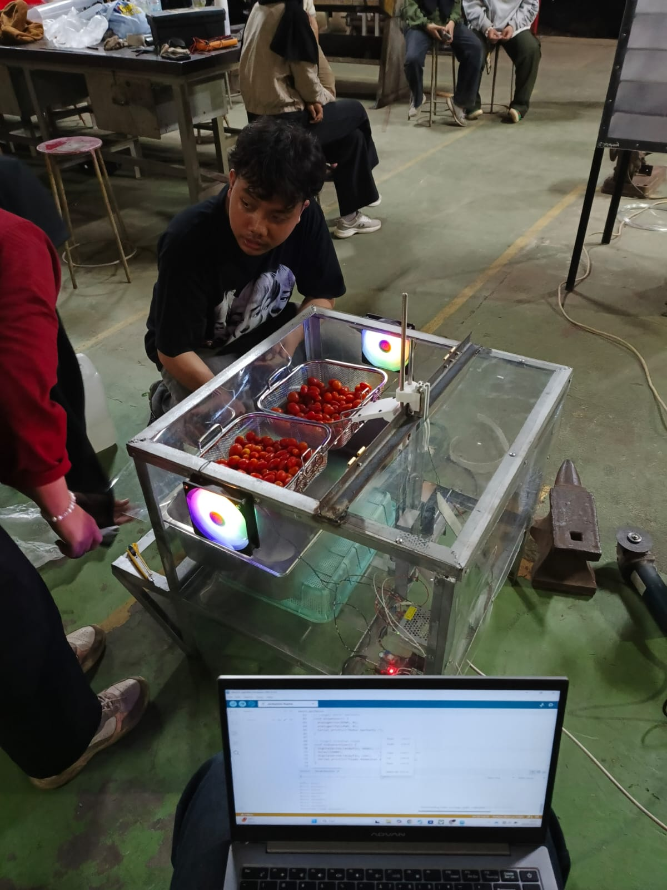
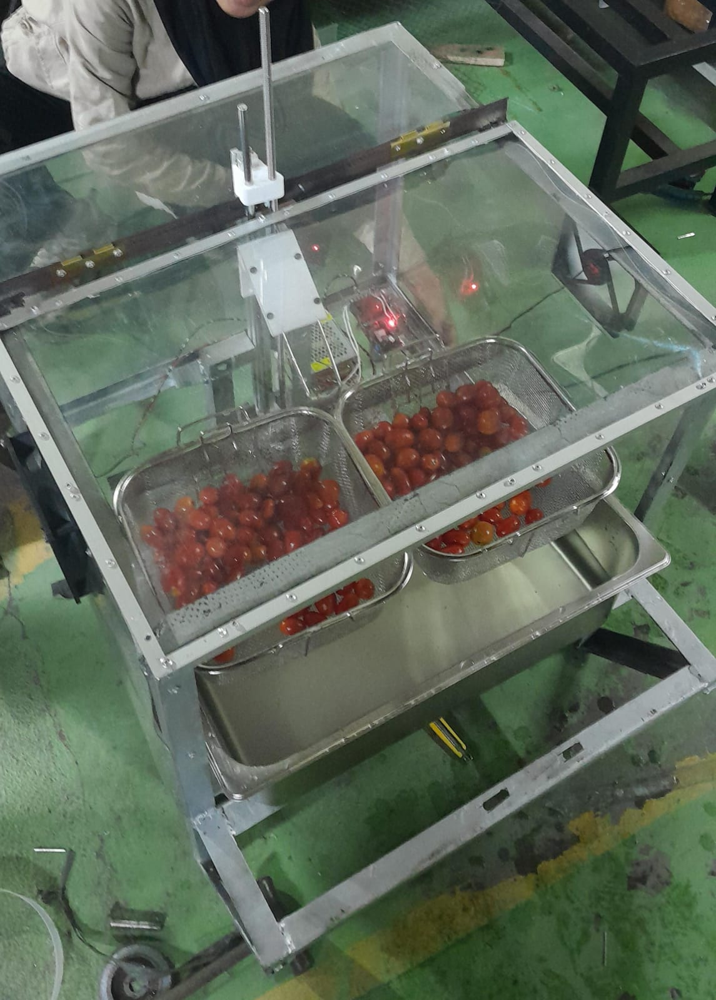

# CHER-FARS : Semi-Automatic Edible Coating Device for Cherry Tomatoes to Extend Their Shelf Life

## Overview
**CHER-FARS** is a semi-automatic edible coating device designed to improve the shelf life of cherry tomatoes. The system applies an edible coating solution using a dipping mechanism followed by a controlled drying process. 

I developed this machine as part of my capstone course project at IPB University with my team. The system uses a simple Arduino-based control program and a screw-driven linear actuator. I chose this mechanism because the load is approximately 2 kg, which requires high torque. To achieve this, I used a stepper motor combined with a lead screw mechanism, allowing the system to generate greater force and provide precise linear motion. This device was developed to increase coating efficiency, ensure uniform coating thickness, reduce labor requirements, and improve the preservation of cherry tomatoes during storage.

  
  

## Problem Statement
Cherry tomatoes have a relatively short shelf life, typically lasting only **3–4 days in fresh condition** before quality degradation occurs.
The conventional edible coating process using manual dipping methods has several limitations:
- Requires a relatively long processing time
- Coating thickness is often inconsistent
- Requires multiple workers
- Risk of contamination and inefficient material usage

To address these challenges, **CHER-FARS** was developed as a semi-automatic edible coating system.

---

## Project Objective
The objective of this project is:
- To design and develop a **semi-automatic edible coating machine**
- To improve **time efficiency and coating effectiveness**
- To produce **uniform coating layers on cherry tomatoes**
- To help **extend the shelf life** of fresh cherry tomatoes

---

## System Specifications
| Parameter | Specification |
|----------|---------------|
| Device Dimensions | 75 × 60 × 60 cm |
| Cherry Tomato Capacity | 1.5 kg |
| Solution Tank Capacity | 5 – 13 L |
| Dipping Time | 1 minute |
| Drying Time | 10 minutes |
| Power Supply | DC 12V |

---

## System Components
The main components used in CHER-FARS include:
- DC Motor
- V-Slot Aluminum Frame
- AC-DC Converter
- Arduino Nano
- Relay 12V
- Cooling Fan
- Control Button
- Container (13 L capacity)
- Frying Basket Filter (1.5 kg capacity)

---

## Working Mechanism

The working mechanism of CHER-FARS consists of several stages:

### 1. Loading
Cherry tomatoes are placed into a **basket filter container**.

### 2. Dipping Process
The basket is automatically lowered into the edible coating solution for **1 minute** using a **linear actuator with a V-belt transmission system**.

### 3. Drying Process
After dipping, the tomatoes undergo a **drying process for 10 minutes** using air circulation from a fan.

### 4. Unloading
Once the drying process is completed, the coated tomatoes are removed from the basket.

## Authors
Capstone Design Team
- Rafly Raihan
- Septi F
- Picha
- Altaf Husain
